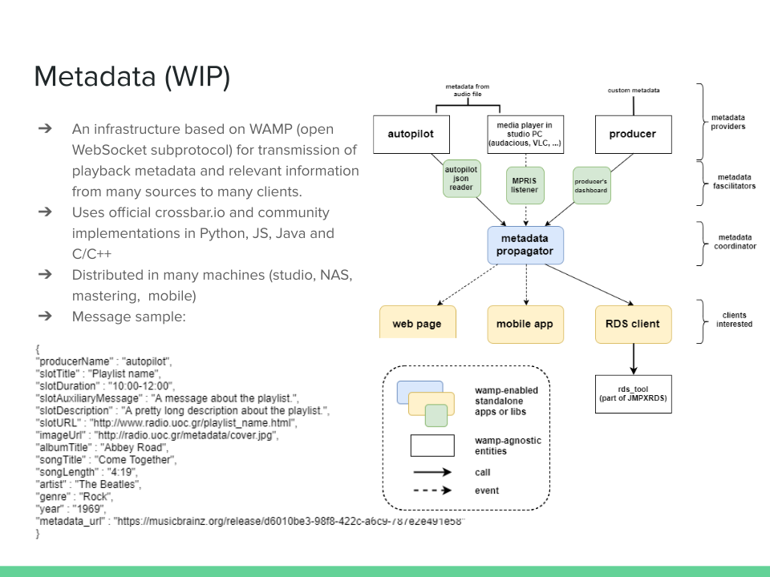

# mantato
[](https://python-poetry.org/)

A metadata flow manager for receiving and propagating song metadata based on [RabbitMQ](https://www.rabbitmq.com/).

Currently supports only autopilot metadata, however some stub functionality is already there to support messages from [producer's dashboard](https://github.com/UoC-Radio/py-producers-dashboard).

# Overview


# Consumption

## javascript - example from our site.

```javascript
var connection = new autobahn.Connection({
  url: 'ws://83.212.124.250:8080/ws',
  realm: 'metadata-realm',
  authid: "anonymous"
});

connection.onopen = function(session) {

  // 1) subscribe to a topic
  function onevent(args) {
    //console.log("Event:", args[0]);
    metadata = $.parseJSON(args[0]);
    if (metadata.songTitle && metadata.artist) {
      $('#autopilot').html('Autopilot plays ' + metadata.slotTitle);
      $('#metadata').html(metadata.songTitle + ' by ' + metadata.artist + ' <a href=' + metadata.metadata_url + ' target="_blank">[' + metadata.albumTitle + ']</a>' + '<br/>');
    }
  }
  session.subscribe('com.metadata.client.metadata_event', onevent).then(
    function(sub) {
      console.log("subscribed with subscription ID " + sub.id);
      session.call('wamp.subscription.get_events', [sub.id, 1]).then(
        function(history) {
          metadata = $.parseJSON(history[0].args[0]);
          if (metadata.songTitle && metadata.artist) {
            $('#autopilot').html('Autopilot plays ' + metadata.slotTitle);
            $('#metadata').html(metadata.songTitle + ' by ' + metadata.artist + ' <a href=' + metadata.metadata_url + ' target="_blank">[' + metadata.albumTitle + ']</a>' + '<br/>');
          }
        },
        function(err) {
          console.log("could not retrieve event history", err);
        }
      );
    },
    function(err) {
      console.log("could not subscribe", err);
    }
  );

};

connection.open();
```
