# mantato

A metadata flow manager for receiving and propagating song metadata based on [RabbitMQ](https://www.rabbitmq.com/).

Currently supports only autopilot metadata, however some stub functionality is already there to support messages from [producer's dashboard](https://github.com/UoC-Radio/py-producers-dashboard).

# Overview

# Consumption
Examples on how to consume the metadata are included in tests folder and in our [website code](https://github.com/UoC-Radio/rastapank-site/blob/38da9fe9892bdd3eed168dcb0cc225ed46e81049/src/components/RadioPlayer.js#L106-L129).